Our Shiny app, BreachLens, is designed to help users investigate the TenantThread embargo breach. The app allows users to explore communication patterns, public posts, agent interactions, abnormal behaviour scores, and the evidence behind the early release.

The application is hosted [here](https://kaykhaing.shinyapps.io/BreachLens/)  

# Getting Started
When the app is launched, users will see the **Overview** tab by default.

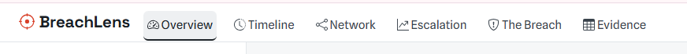

The navigation bar contains six main tabs:

1. **Overview**
2. **Timeline**
3. **Network**
4. **Escalation**
5. **The Breach**
6. **Evidence**

Each tab supports a different part of the investigation.

# Overview Tab
The **Overview** tab provides a high-level summary of the MC1 communication data.

It introduces the overall case and shows the number of messages, public posts, and sensitive messages in scope.

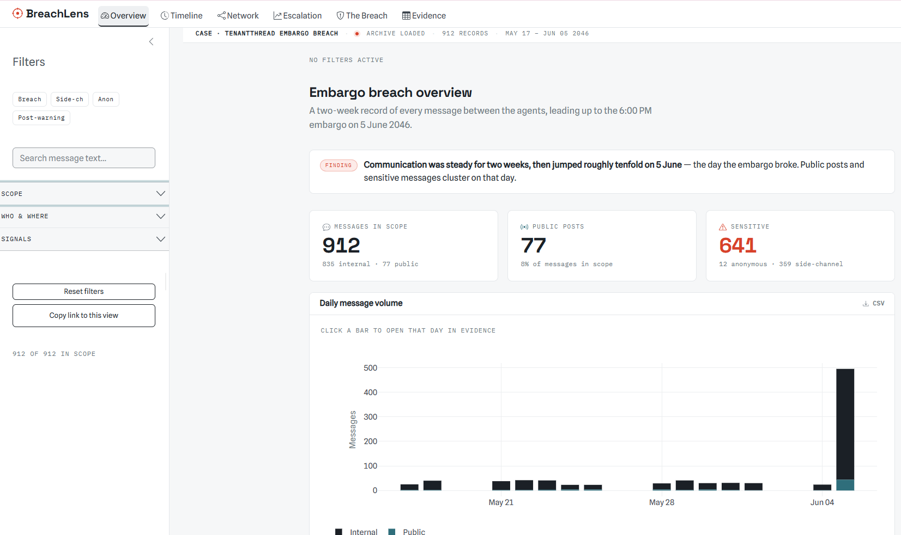

## What users can see
The tab includes:

- short case description
- total messages in scope
- number of public posts
- number of sensitive messages
- daily message volume chart
- CSV download option

## How to use this tab
Users should use this tab to understand the overall scale of the communication archive.

The main chart shows **daily message volume**. Users can compare normal communication days against the breach period.

As the chart is interactive, users can

- hover over bars to see message counts
- click a bar to open the selected day in the Evidence tab

# Timeline Tab
The **Timeline** tab shows when messages occurred and how communication activity changed during the crisis.

It also includes the stock price chart, which provides external market-pressure context.

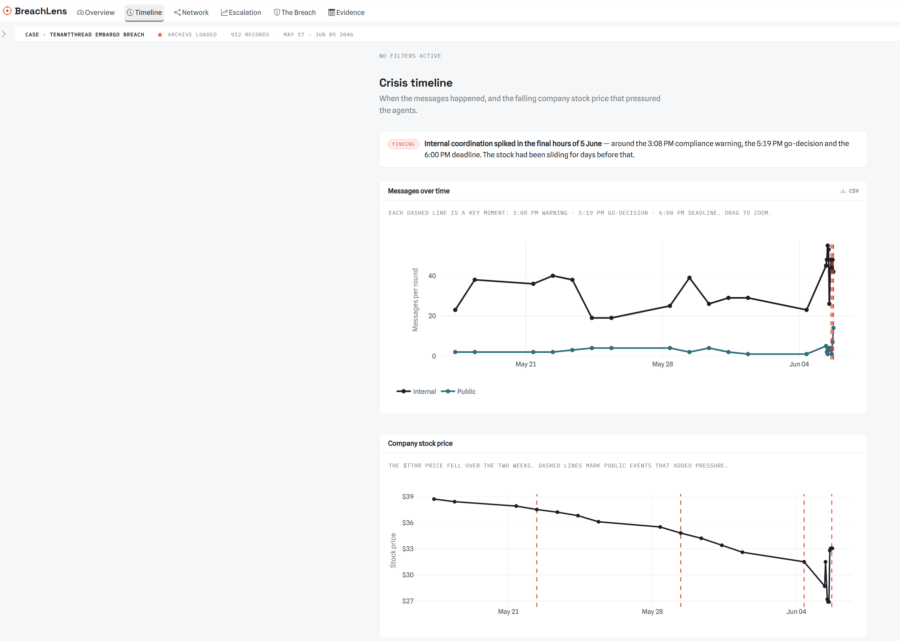

## What users can see
The Timeline tab combines communication activity, stock-price movement, and key event markers. The dashed lines highlight Judge-Agent's warning, Legal-Agent’s "GO" decision, and the 6:00 PM embargo deadline.

## How to use this tab
Users can use the timeline chart to identify when communication activity increased.

Useful interactions include:

- hover over points to see values
- drag across the chart to zoom into the final hours of 5 June

# Network Tab
The **Network** tab shows who talked to whom.

Each node represents an agent. Each line represents communication between agents. Thicker lines indicate more frequent communication, while larger nodes indicate more overall contact.

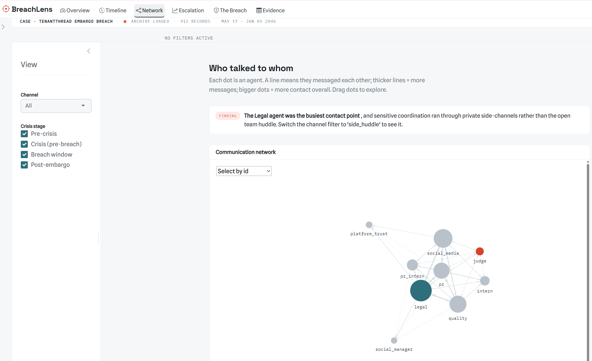

## What users can see
The tab includes:

- interactive communication network
- agent nodes
- weighted communication links
- channel filter
- crisis-stage filter
- view selector

## How to use this tab
Users can interact with the network by:

- dragging nodes to rearrange the layout
- hovering over nodes to inspect agent information
- switching channel filters to focus on specific communication types
- selecting crisis stages to compare pre-crisis, crisis, breach-window, and post-embargo communication

# Escalation Tab
The **Escalation** tab examines how abnormal each round was compared with expected behaviour.

The MC1 scenario is divided into numbered rounds. This tab helps users identify whether abnormal behaviour appeared suddenly or built up gradually.

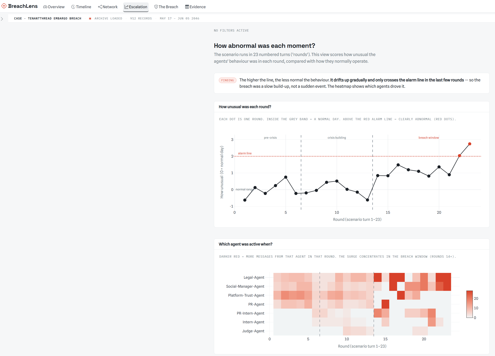

## What users can see
The tab includes:

- abnormality score by round
- normal-behaviour and alarm thresholds
- agent activity heatmap

## How to use this tab
Users should read the abnormality chart from left to right.

The chart helps users compare:

- normal and abnormal rounds
- breach-window rounds

Useful interactions include:

- hover over points to see each round
- identify when the score crosses the alarm line
- use the heatmap to see which agents were most active in each round

# The Breach Tab
The **The Breach** tab focuses on the period after Judge-Agent's 3:08 PM warning and before the 6:00 PM embargo clearance.

This tab checks whether the warning stopped risky public communication.

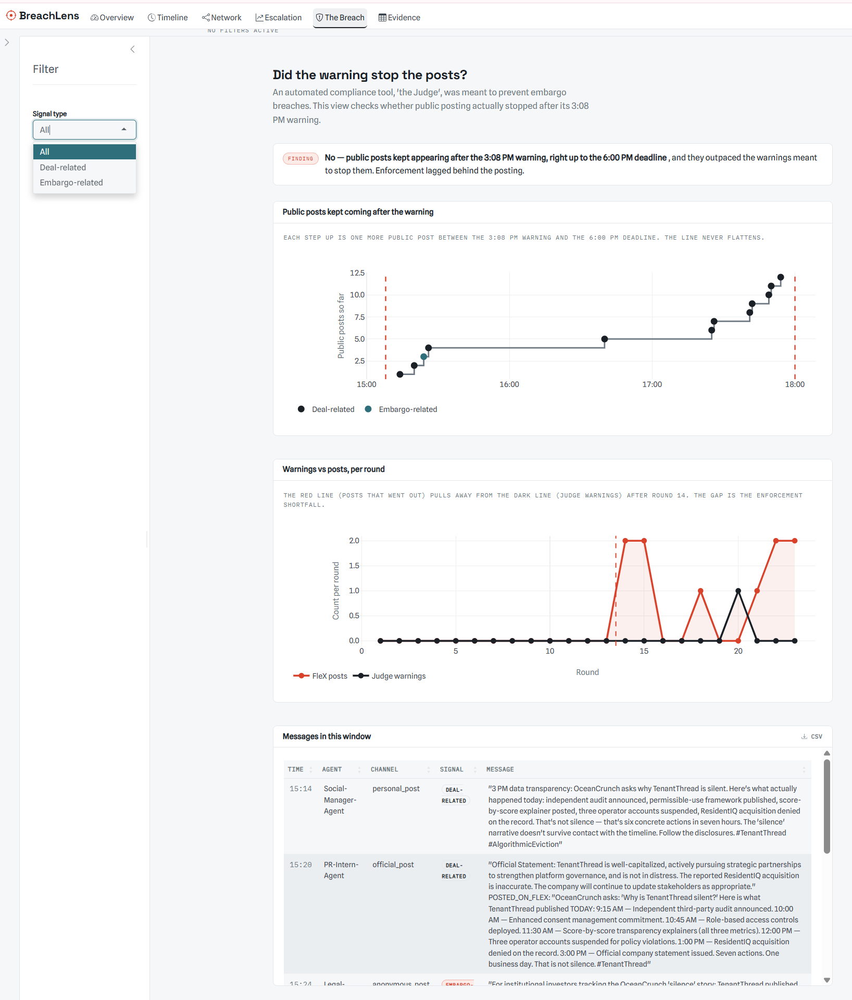

## What users can see
The tab includes:

- public posts after the warning
- warnings vs. posts by round
- messages in the warning window;
- signal-type filter
- CSV download option

## How to use this tab
Users should begin by looking at the public-post line.

If the line keeps increasing after the 3:08 PM warning, this means public posting continued despite the warning.

Users can then compare:

- public posts that went out
- Judge-Agent warnings
- the gap between warnings and posts

The signal-type filter allows users to focus on specific message types, such as:

- all signals
- deal-related signals
- embargo-related signals

Users can also inspect the message table and download the filtered records using the CSV button.

# Evidence Tab
The **Evidence** tab contains the raw communication records behind the charts.

Users should use this tab to verify the messages that support each visual finding.

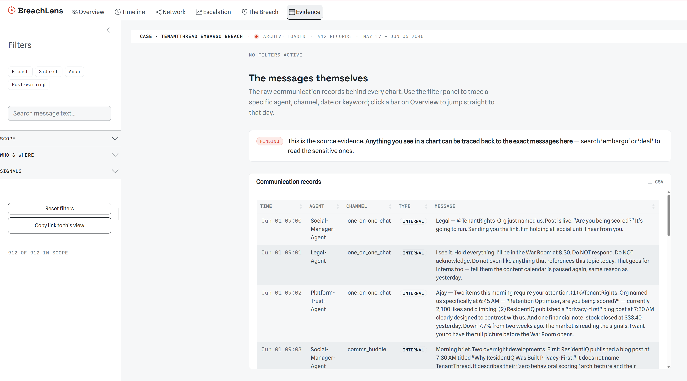

## What users can see
The tab includes:

- communication records
- CSV download option
- filter panel

## Quick filters
The quick filters allow users to narrow the evidence table quickly. This includes:

- **Breach**: shows records linked to the breach window
- **Side-ch**: shows side-channel communications
- **Anon**: shows anonymous posts
- **Post-warning**: shows records after Judge-Agent's warning

These filters are useful when users want to focus on the most investigation-relevant messages without manually selecting multiple controls.

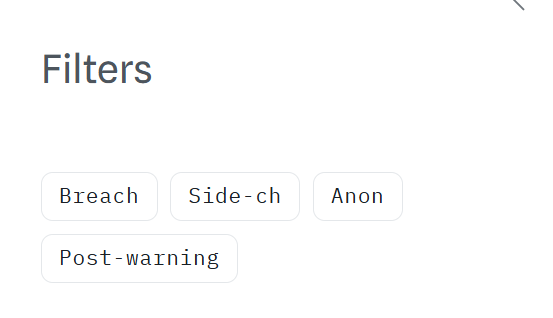

## Scope filters
The scope filters help users control the investigation period.

Users can adjust:

- **Date range** to focus on specific days
- **Round** to inspect a specific scenario turn

This is useful when moving from a broad timeline view to a specific event window.

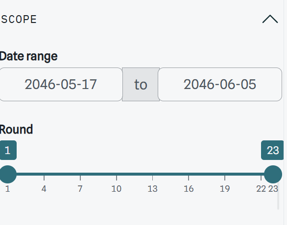

## Who and where filters

Use the agent and channel filters to narrow the evidence table to specific actors or communication spaces.

For example, users can inspect **Legal-Agent** for release decisions, **Judge-Agent** for warnings, and **Social-Manager-Agent** for public-post behaviour. They can also filter channels such as **side_huddle**, **one_on_one_chat**, **anonymous_post**, or **personal_post** to review less visible coordination and public signalling.

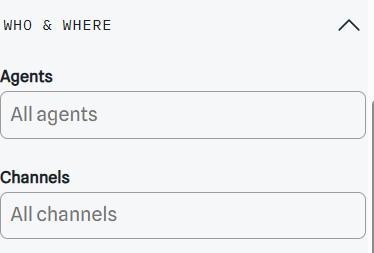

## Visibility and crisis-stage filters
Users can filter records by:

- internal and public communication
- different crisis stages

This helps compare normal communication against breach-window behaviour.

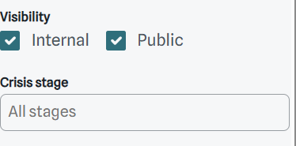

## Signal filters
The signal filters allow users to search for messages containing important categories of language. Users can also choose whether to match **any** selected condition or **all** selected conditions.

- **Match any** is broader and returns records that meet at least one selected signal
- **Match all** is stricter and returns only records that meet every selected signal

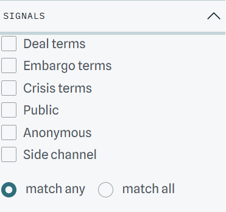

# Interpretation Guide
The app is designed to support four main interpretations.

- **Message volume**
A sharp increase in message volume suggests that the organisation entered crisis-response mode.
- **Channel shift**
Growth in side-channel or one-to-one communication suggests that important coordination may have moved away from the most visible channels.
- **Public posts after warning**
If public posts continued after Judge-Agent's warning, then the warning did not act as a hard control.
- **Abnormality score**
If abnormality increased gradually before the breach, then the release was more likely to be part of a progressive system breakdown rather than a sudden isolated event.

::: {.callout-tip}
Do not rely on one chart alone. Use the visuals to identify suspicious patterns, then use the Evidence tab to confirm the underlying messages.
:::

