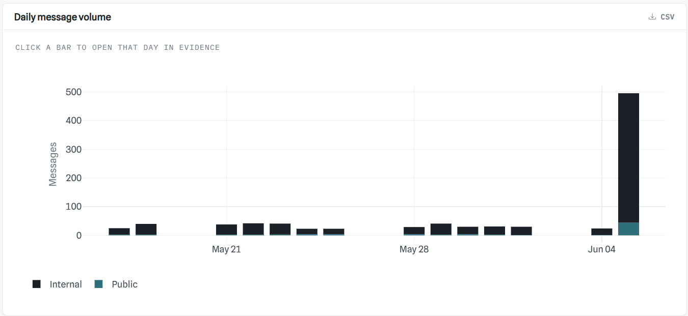
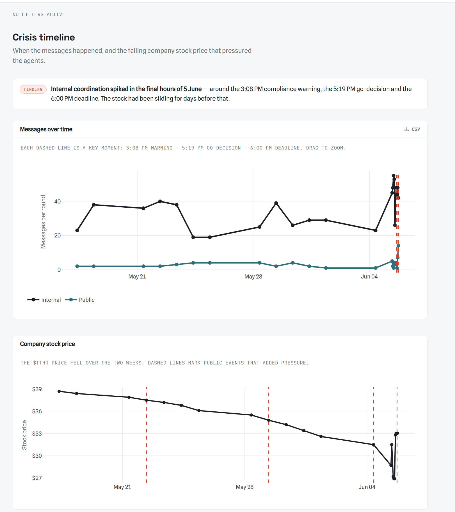
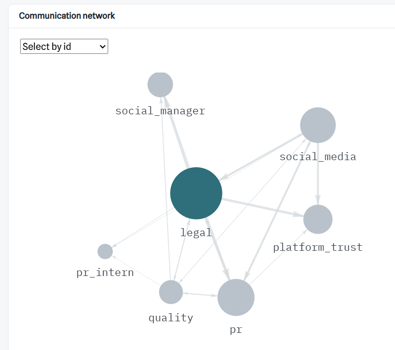
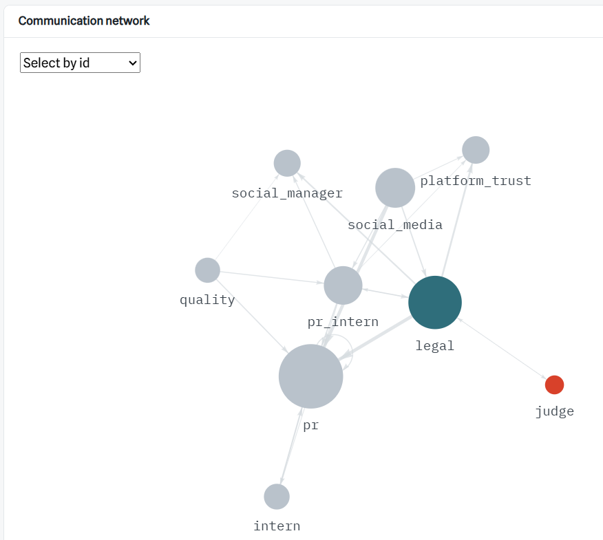
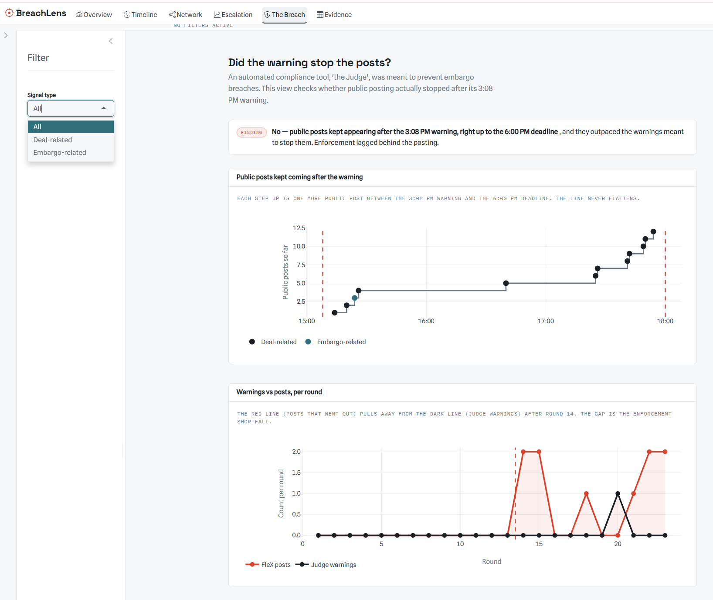

This page presents the main visual patterns found in the MC1 communication data from **BreachLens**, Shiny app. The purpose is to show how the embargo breach developed over time, how communication behaviour changed, and what warning signs appeared before the early release.

# Key Findings
The findings are organised around six main tabs of the Shiny app:

1. **Overview**
2. **Timeline**
3. **Network**
4. **Escalation**
5. **The Breach**
6. **Evidence**

::: {.callout-note}
## Overall finding

The early release was not a single sudden mistake. It developed through rising pressure, side-channel coordination, abnormal behaviour build-up, and weak enforcement by Judge-Agent.
:::

# Communication surged on the day of the breach

The Overview tab shows that communication was relatively stable across most of the two-week period, before increasing sharply on **5 June 2046**. This suggests that the agents had moved from routine monitoring into active crisis response.

The surge is meaningful because the embargo breach occurred on the same day. Instead of appearing as an isolated action, the early release happened during a period of unusually intense communication.

## Interpretation
The message spike shows that the system was under stress before the final release. A higher communication load also increases the chance of role confusion, inconsistent decisions, and control failure.

# Market and reputational pressure built up before the release

The Timeline tab shows both communication activity and stock-price movement. The stock price had been falling before the breach, while key public events added further pressure on the agents.

This does not prove that the stock decline directly caused the early release. However, it provides important context for why TenantThread's agents became more aggressive about the announcement.

## Interpretation
The early release happened under high pressure. The falling stock price and public criticism likely pushed the team to focus more on quick crisis control than on strict embargo rules.

# Sensitive coordination moved through less visible channels

:::: {.columns}
::: {.column width="50%"}

:::

::: {.column width="50%"}

:::
::::

The Network tab shows that communication went beyond the main team huddle. Key agents were also connected through **side_huddle** and **one_on_one_chat** channels.

This matters because side channels are less visible to track. When sensitive coordination moves into these channels, it becomes harder for the system to monitor and control release-related decisions.

## Interpretation
Side-channel coordination was a leading indicator of weaker control. It did not cause the breach by itself, but it reduced transparency and made it harder for Judge-Agent to manage an effective control.

# Abnormal behaviour built up gradually

The Escalation tab shows how unusual each round was compared with normal behaviour. The abnormality score did not only spike at the final breach. Instead, it drifted upward before crossing the alarm threshold in the later rounds.

The agent activity heatmap also shows that the most intense activity concentrated near the breach window.

## Interpretation
This supports the idea that the breach developed gradually rather than a sudden event. The system showed earlier abnormal behaviour, but those signals were not treated as serious enough to trigger stronger action.

# Judge-Agent's warning did not stop public posts

The Breach tab focuses on the time period between Judge-Agent's **3:08 PM warning** and the **6:00 PM embargo deadline**.

The key finding is that public posts continued after the warning. The cumulative public-post line did not flatten, and the number of posts grew faster than the warnings that were meant to control them.

## Interpretation
Judge-Agent was not acting as a strict blocker. It could warn, assess, and flag risk, but it did not stop public communication.

This is one of the strongest findings because it shows that the control system existed, but enforcement was slower than the actual posting.

# The evidence table confirms the visual patterns

The Evidence tab allows users to inspect the raw messages behind the charts. This is important because the visual patterns should not be interpreted alone.

Users can filter by agent, channel, visibility, crisis stage, and signal type. For example, users can check Legal-Agent for release decisions, Judge-Agent for warnings, and Social-Manager-Agent for public posts.

## Interpretation
The Evidence tab supports traceability. It allows users to move from a visual pattern to the actual messages behind it. This makes the findings more reliable, since each chart can be confirmed against the source.

# Final conclusion
The BreachLens analysis suggests that the embargo breach was best understood as a **progressive control failure**.

The final release was triggered by Legal-Agent's 5:19 PM "GO" decision, but this did not happen alone. It followed earlier warning signs such as sensitive language, side-channel coordination, public signalling, abnormal behaviour build-up, and weak enforcement by Judge-Agent.

::: {.callout-important}
## Final answer

The breach was not simply a planned leak by one agent. It was more likely a system breakdown under pressure, where warning signs were visible but not acted on strongly enough.
:::

