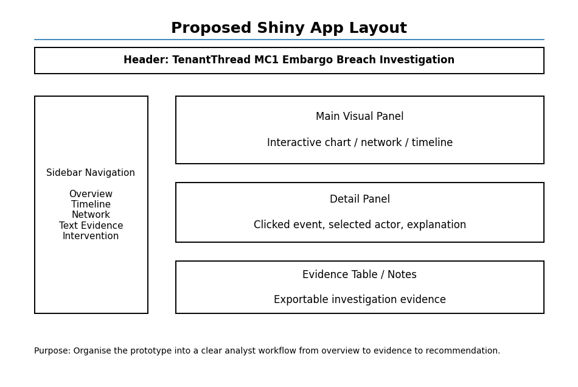
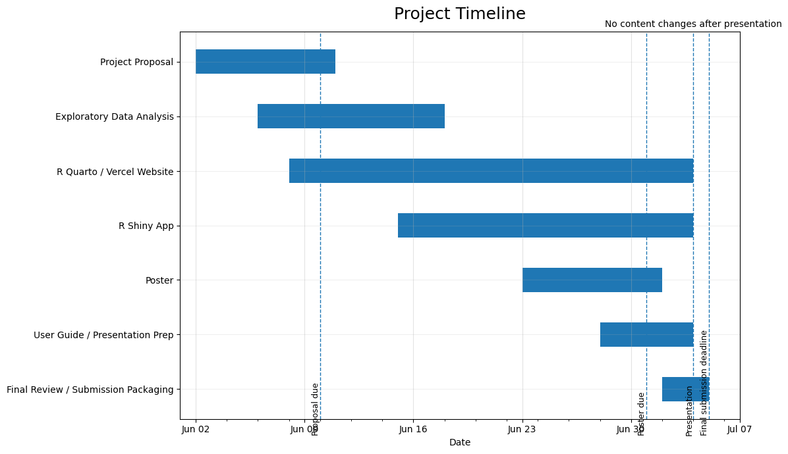

## Motivation
The project aims to understand how things can go wrong when people, systems, and tools have to work together under pressure. In [VAST Challenge 2026 Mini-Challenge 1](https://vast-challenge.github.io/2026/MC1.html), TenantThread broke an embargo on its merger with CivicLoom Realty Partners when the news appeared early on FleX instead of the planned 6:00 PM release on 5 June 2046. This was not just a simple mistake of posting too early but a wider breakdown across Legal, PR, Social Media, Platform Trust, and an automated tool called "The Judge", along with side channels and public accounts. The key question is whether this was a deliberate leak or a system failure. This project builds a visual analytics system to help reconstruct the sequence of events, compare normal and abnormal communication patterns, and identify early warning signs of the breach.

## Objectives
This project aims to develop an interactive visual analytics tool to help analysts investigate the TenantThread embargo breach. The key objectives are:

- **Reconstruct the release sequence** by showing the key events, actors, decisions, and links that led to the early release of merger information.
- **Compare normal and abnormal behaviour** by analysing how communication changed from routine activity to crisis behaviour.
- **Identify actor and channel shifts** by examining how different actors used official, internal, side, personal, and anonymous channels during the crisis.
- **Detect sensitive language patterns** by tracking how deal-related, embargo-related and crisis-related language changed over time. 
- **Assess the role of The Judge** by examining whether it worked as a control tool or only as a warning system..
- **Detect early warning signs** that could explain the breach and support legal analysis of whether it was a planned leak or a breakdown under pressure

## Data
The project will use the data from VAST Challenge 2026 Mini-Challenge 1, which includes TenantThread's internal and public communications before the embargo breach. The data will be organised into three tables:

- **Round-level table**: one row per round or hour, with the timestamp, event headline, crisis stage, market information, social state, and communication count.
- **Communication-level table**: one row per message, with the timestamp, actor role, actor label, channel, message type, content, and sensitive language flags.
- **Participants table**: one row per participant, with the participant label, role, and channel usage.

The communications will be classified into four stages: pre-crisis, crisis before release, premature release, and post-embargo.

### Known data quality issues:
Stock price fields in the market_snapshot for 5th June hourly rounds contain corrupted values (\$18, \$180). These will be replaced with prices quoted in agent messages for that period.

## Methodology


## Prototype Sketches

```{r}
#| echo: false
#| out-width: "90%"
#| fig-align: "center"


```

## R Packages

The following R packages will be used to support data preparation, text analysis, timeline reconstruction, network analysis, behaviour comparison, and Shiny application development for Mini-Challenge 1.

### Utility and Data Preparation

* **jsonlite:** To import and parse the MC1 JSON dataset, which contains nested records such as rounds, environment context, communications, internal agent states, participants, and message metadata.
* **tidyverse:** To clean, transform, filter, and summarize the dataset into analysis-ready tables.
* **dplyr:** To group and compare communication records by agent, channel, message type, timestamp, and event period.
* **tidyr:** To unnest nested JSON fields such as communications, internal states, media events, market snapshots, and agent metadata.
* **purrr:** To handle repeated list-column operations when processing nested agent outputs and communications.
* **lubridate:** To convert timestamps into proper date-time formats and support time-based filtering around the embargo breach.
* **stringr:** To clean and extract keywords from message content, internal deliberations, public posts, hashtags, and references to Project HarborCrest or CivicLoom.
* **DT:** To provide interactive tables for inspecting raw messages, filtered communications, and evidence linked to key events.

### Text Analytics

* **tidytext:** To tokenize messages and internal states for keyword frequency, phrase extraction, and comparison between normal communications and breach-related communications.
* **quanteda:** To build document-feature matrices and compare language patterns across agents, channels, and time periods.
* **tm:** To support text preprocessing such as corpus creation, stopword removal, and document-term matrix construction.
* **SnowballC:** To apply stemming where useful, so related word forms can be grouped during text analysis.
* **sentimentr:** To estimate sentiment and tone shifts in agent communications before and during the embargo breach.
* **widyr:** To identify word correlations and co-occurring terms, such as links between Project HarborCrest, CivicLoom, embargo, The Judge, FleX, and announcement.

### Timeline and Event Sequence Visualization

* **ggplot2:** To create event timelines, agent activity charts, channel usage charts, and behaviour comparison plots.
* **plotly:** To make timeline and activity visualizations interactive through hover labels, zooming, and filtering.
* **timevis:** To create an interactive timeline showing the sequence of events leading up to the premature release.
* **ggrepel:** To improve readability of annotated timeline labels, especially for key decision points and breach-related messages.

### Network and Causal Relationship Analysis

* **igraph:** To construct agent-to-agent and agent-to-system communication networks.
* **tidygraph:** To manipulate network data using tidy data principles.
* **ggraph:** To visualize relationships between agents, channels, decisions, public posts, and compliance checks.
* **visNetwork:** To build an interactive network graph that allows users to explore who communicated with whom, through which channel, and around which key events.
* **networkD3:** To create Sankey-style flow diagrams showing how information moved from internal deliberations to public FleX posts.
* **DiagrammeR:** To create directed causal diagrams that explain the chain of decisions and system elements that allowed embargoed information to pass through enforcement.

### Behaviour Comparison and Anomaly Detection

* **anomalize:** To identify unusual changes in communication volume, channel usage, posting behaviour, or agent activity before the breach.
* **zoo:** To calculate rolling averages and compare the breach period against prior baseline behaviour.
* **scales:** To format dates, counts, and percentage changes clearly in visualizations.
* **forcats:** To reorder categorical variables such as agents, channels, and message types based on frequency or importance.

### Shiny Application Development

* **shiny:** To build the main interactive visual analytics application.
* **bslib:** To design a clean and modern dashboard interface.
* **shinyWidgets:** To provide interactive filters such as agent selector, channel selector, date range selector, and message type selector.
* **shinycssloaders:** To display loading indicators while large visualizations are being generated.
* **shinydashboard:** To structure the application into sections such as overview, event timeline, network view, text analysis, anomaly detection, and evidence table.

These packages will support the development of a visual analytics system that helps users reconstruct the embargo breach, identify the key agents and decisions involved, compare breach behaviour against normal system behaviour, and detect earlier warning signs where agent behaviour differed from expected behaviour.

## Project Schedule

```{r}
#| echo: false
#| out-width: "90%"
#| fig-align: "center"


```


